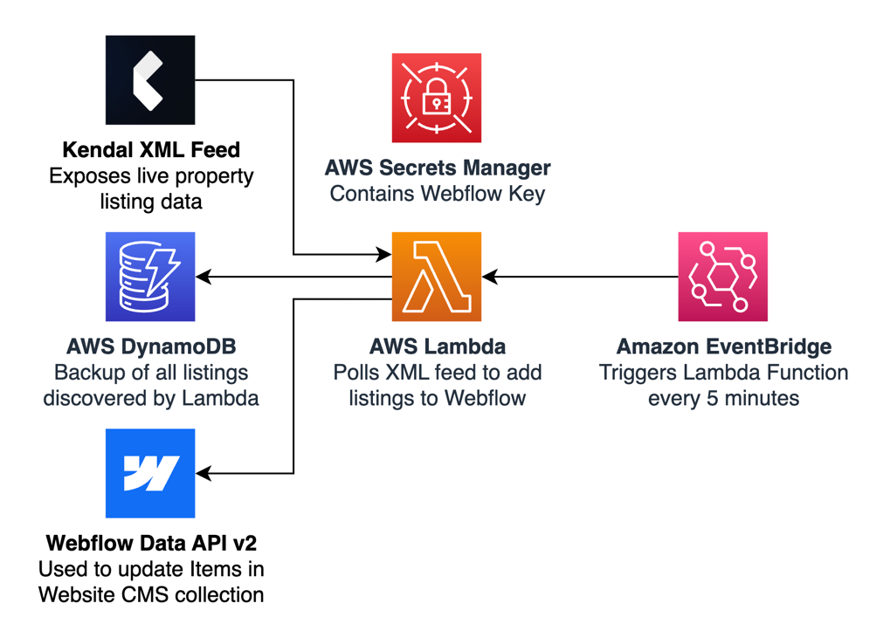

# PropSync 🏡🔗

> **PropSync** is an AWS Lambda Function designed to syncronise property listing data between [Kendal CRM](https://www.kendal.ai) and a Webflow CMS.

**PropSync** is designed to work out-of-the-box, and only requires a working AWS account configured locally on your machine (i.e. `aws configure`), and a [Webflow Site Token](https://developers.webflow.com/data/reference/site-token) saved to AWS Secrets Manager

**Table of Contents**
+ [Architecture](#architecture)
+ [Getting Started](#getting-started)
+ [Resources](#resources)

---

### Architecture

The foundation of this deployment is an AWS Lambda Function that performs the following actions:

+ **Poll Kendal XML Feed** to identify changes in listings (e.g. new property added, listing removed, etc.)
+ **Update DynamoDB** with any _new_ listings identified — this DB is non-functional, and is simply used to store a history of listings for posterity.

> **💡 Note:** DynamoDB may need to serve as a mapping between the unique property ID from Kendal, and the ID associated with each item in Webflow, so as to easily identify which items have been delisted from Kendal (then update Webflow accordingly)

+ **Call the Webflow API** to add new listings, and remove those which have been delisted from the Kendal CRM.

The Lambda Function is supported by an EventBridge 'cron job', which triggers an invocation every _X_ minutes.

###### _AWS Architecture Diagram_

### Getting Started

XX

### Resources

+ [Kendal XML Feed Documentation](https://kendal-ai.notion.site/XML-Feed-Documentation-for-Listings-13fa8cf7e41780d786aef6eec2357bc7)
+ [Sample Kendal XML Feed](https://firebasestorage.googleapis.com/v0/b/kendal-testing.appspot.com/o/xml-feed%2FNxN2EaxsPdWlcVwIoadI%2Fexternal_website.xml?alt=media&token=198ba426-f4b0-4567-8680-7cd82b49b8ef)
+ [Webflow CMS API Documentation](https://developers.webflow.com/data/reference/cms/collection-items/staged-items/list-items)